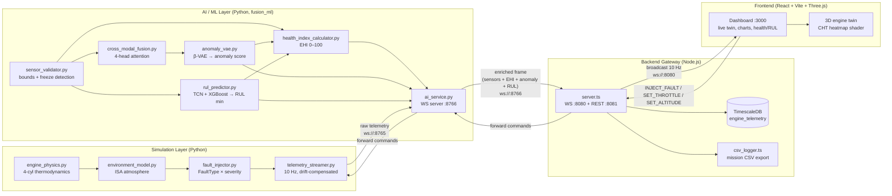

# AeroTwin — Final MVP Architecture

**Smart India Hackathon 2026 · SIH26054 · DRDO — MALE UAV Aero Piston Engine Digital Twin**

This document is the *final MVP architecture* — the smallest end-to-end prototype that can be
built quickly and demonstrated reliably. Every component maps to code already in this
repository. Anything not listed here is **roadmap**.

---

## 1. Mermaid Architecture Diagram



**Ports (canonical):** simulator `8765` · AI service `8766` · backend WS `8080` · REST `8081` ·
frontend `3000` (dev) / `80` (nginx) · DB `5432`.

---

## 2. Exact Components

| Layer | Component | Files (in repo) | Responsibility |
|---|---|---|---|
| **Simulator** | Engine physics | `simulator/engine_physics.py` | 4-cyl boxer thermodynamics, crank-slider kinematics, BSFC fuel flow |
| | Environment | `simulator/environment_model.py` | ISA atmosphere, weather modifiers (humidity, rain, dust) |
| | Fault injector | `simulator/fault_injector.py` | 5+ fault modes with severity and ramp rate |
| | Streamer | `simulator/telemetry_streamer.py` | 10 Hz WS server, broadcast + command ack |
| **ML** | Sensor validator | `fusion_ml/sensor_validator.py` | Physical bounds, freeze detection, sensor mask |
| | Fusion | `fusion_ml/cross_modal_fusion.py` | Thermal/mechanical/fluid attention fusion |
| | Anomaly | `fusion_ml/anomaly_vae.py` | β-VAE reconstruction error → score 0–100 |
| | Health index | `fusion_ml/health_index_calculator.py` | EHI 0–100 from residuals, anomaly, RUL |
| | RUL | `fusion_ml/rul_predictor.py` | TCN + XGBoost → RUL minutes + RTB level |
| | Service | `fusion_ml/ai_service.py` | WS server, enrichment pipeline, model hot-reload |
| **Backend** | Gateway | `backend/src/server.ts` | Receives enriched frames, stores, broadcasts, forwards commands |
| | Config | `backend/src/config.ts` | Env-driven ports/URLs |
| | DB access | `backend/src/db/` | Batch insert into TimescaleDB |
| | CSV logger | `backend/src/services/` | Mission log → CSV export |
| **Frontend** | Dashboard | `frontend/src/App.tsx`, `pages/`, `components/` | Live twin, telemetry charts, health/RUL panels, fault controls |
| | 3D twin | `frontend/src/shaders/`, `components/` | Three.js engine with CHT heatmap |
| **DB** | TimescaleDB | `backend/src/db/schema.sql` | Hypertable telemetry + 1-min rollups |

**Synchronous (10 Hz tick):** physics step → sensor validation → fusion → anomaly → EHI → RUL →
WS broadcast. **Asynchronous:** DB batch insert, CSV logging, rollup materialization, model
loading (offline).

---

## 3. REST API Endpoints (MVP)

Implemented in `backend/src/server.ts`:

| Method | Path | Purpose |
|---|---|---|
| GET | `/health` | Component status: AI connection, WS clients, DB, frames received/broadcast |
| GET | `/api/mission/replay?start&end&mission_id&limit` | Time-range telemetry for replay charts |
| GET | `/api/logs/download` | Current mission CSV export |

Thin additions worth the 48-hour budget:

| Method | Path | Purpose |
|---|---|---|
| POST | `/api/mission/start` | Begin a named mission (sets `mission_id`, resets counters) |
| POST | `/api/mission/stop` | End mission, finalize CSV + summary |
| GET | `/api/mission/summary?mission_id` | Stats: duration, max anomaly, min RUL, fault events |
| POST | `/api/faults/inject` | Body `{type, severity}` → forwarded to simulator |
| POST | `/api/faults/clear` | Clear all injected faults |
| GET | `/api/engine/state` | Latest enriched frame (page refresh / reconnect) |

**Roadmap:** `GET /api/engine/{id}/health|faults|rul`, `POST /api/simulation/*`, auth/roles,
fleet endpoints.

---

## 4. WebSocket Message Flow

**Hop 1 — simulator → AI service (`ws://:8765`), 10 Hz broadcast:**

```json
{"timestamp":"2026-09-03T10:00:00.123Z","frame_id":4821,"altitude_ft":18000,
 "throttle":0.65,"rpm":5200,"map_kpa":82.4,"fuel_flow_lph":12.3,
 "cht":[142,138,145,140],"egt":[610,598,622,605],"oil_pressure_kpa":410,
 "oil_temp_c":92,"vibration_rms":0.85,"ambient_temp_c":-12.4,"injected_fault":null}
```

**Hop 2 — AI service → backend (`ws://:8766`), enriched frame (adds):**

```json
{"health":{"ehi":88.4,"combustion_efficiency":96.1},
 "anomaly":{"score":12.7,"is_detected":false},
 "prognostics":{"predicted_rul_min":415,"rtb_alert_level":"NONE"},
 "sensor_status":{"active_sensors":15,"isolated_sensors":[]}}
```

**Hop 3 — backend → frontend (`ws://:8080`)**, same enriched frame + control-plane messages:
server→client `WELCOME`, `PONG`, `STATS`, `ERROR`; client→server `TRIGGER_FAULT {fault,severity}`,
`CLEAR_FAULTS`, `SET_THROTTLE`, `SET_ALTITUDE`, `PING`, `GET_STATS`.

**Command path (reverse):** dashboard → backend `:8080` → AI service `:8766` → simulator `:8765` →
ack returns along the same path. The 48-hour variant may let the dashboard talk to `:8765` directly.

---

## 5. Database Schema (MVP = one hypertable)

`backend/src/db/schema.sql` — `engine_telemetry` is the entire MVP schema:

| Column | Type | Purpose |
|---|---|---|
| `time` | TIMESTAMPTZ | Hypertable time column |
| `frame_id` | BIGINT | Sequence |
| `rpm, map_kpa, fuel_flow_lph` | REAL | Mechanical/fuel |
| `cht, egt` | REAL[] | Per-cylinder arrays |
| `oil_pressure_kpa, oil_temp_c, vibration_rms` | REAL | Fluid/vibration |
| `ehi, combustion_efficiency` | REAL | AI health outputs |
| `anomaly_score, is_anomaly` | REAL / BOOLEAN | Anomaly detection |
| `predicted_rul_min, rtb_alert_level` | REAL / TEXT | Prognostics (`NONE`/`RTB_ADVISORY`/`RTB_CRITICAL`) |
| `active_sensors, sensor_isolation_flags` | JSONB | Sensor validation |
| `altitude_ft, ambient_temp_c` | REAL | Environment |
| `injected_fault` | TEXT | Ground-truth fault label |
| `mission_id` | UUID | Mission grouping |

Already included: 1-min continuous aggregate for chart rollups, 30-day retention, compression
after 7 days, indexes on `is_anomaly`, `mission_id`, `rtb_alert_level`.

**MVP decision:** skip separate `anomalies`, `fault_predictions`, `rul_predictions`, `missions`
tables — derive them from `engine_telemetry` via filtered views. **Roadmap:** proper `missions`,
`maintenance_advisories`, `model_versions`, `fault_injections` tables once replay/reports become
a product feature.

---

## 6. Folder Structure (current repo = target)

```
project-root/
├── simulator/          # Python 10 Hz engine + fault injection
│   ├── engine_physics.py / environment_model.py / fault_injector.py
│   ├── telemetry_streamer.py / generate_datasets.py / test_client.py
│   ├── physics/ atmosphere/ faults/ tests/
│   └── Dockerfile
├── fusion_ml/          # Python AI enrichment pipeline
│   ├── ai_service.py / sensor_validator.py / cross_modal_fusion.py
│   ├── anomaly_vae.py / health_index_calculator.py / rul_predictor.py
│   ├── models/ tests/ Dockerfile
├── backend/            # Node.js gateway (WS 8080 + REST 8081)
│   ├── src/server.ts / config.ts
│   ├── src/db/schema.sql + repository
│   ├── src/services/ (csv_logger, …)
│   └── tests/
├── frontend/           # React + Vite + Tailwind + Three.js (:3000)
│   ├── src/pages/ components/ services/ context/ hooks/ shaders/ tests/
│   └── Dockerfile / nginx.conf
├── data/               # generated CSVs, model exports
├── docker-compose.yml  # timescaledb + simulator + ai-service + backend + frontend
├── run_demo.sh / run_demo.bat
└── README.md
```

---

## 7. Data Flow: Telemetry → Alert

```
[1] physics step  ──►  [2] sensor validation  ──►  [3] fusion  ──►  [4] anomaly VAE
    10 Hz, sync       bounds + freeze mask      attention vec      score > P99 → anomaly
        │                    │                       │                  │
        ▼                    ▼                       ▼                  ▼
[5] EHI 0–100  ◄────────  residuals + fault signal  ◄── RUL [TCN+XGBoost]  minutes
        │                    │                             │
        ▼                    ▼                             ▼
[6] ai_service :8766 ──► [7] backend :8080 ──► [8] TimescaleDB (async batch)
        │                    │                             │
        ▼                    ▼                             ▼
[9] frontend :3000     RTB_ADVISORY / CRITICAL     1-min rollup views
   live charts + 3D    ──► alert banner +          (replay + reports)
   twin                 maintenance advisory
```

**Alert decision rule (deterministic, explainable):** `RTB_ADVISORY` when
`predicted_rul_min ≤ 30` **or** (`is_anomaly && EHI < 60`); `RTB_CRITICAL` when
`predicted_rul_min ≤ 10` **or** `EHI < 30`. Alerts never come from raw thresholds alone — every
alert carries the contributing residuals (EGT residual, vibration trend, oil-pressure decline)
so the dashboard shows *why*.

**Latency budget:** physics→AI enrichment < 15 ms/frame (validated in `fusion_ml/tests/`);
backend broadcast < 5 ms; DB write non-blocking. End-to-end dashboard lag ≤ 150 ms at 10 Hz.

---

## 8. 48-Hour Simplified Version

Cut to the minimum credible demo. Same file layout, nothing wasted.

**Build order:**

1. **Simulator only** — run `telemetry_streamer.py` at 10 Hz with `enable_noise=True`; verify
   with `simulator/test_client.py`. *(~3 h)*
2. **ML single-process path** — a loop calling
   `sensor_validator → anomaly_vae (pre-trained on generate_datasets.py output) → health_index → rul_predictor`
   in-process, printing enriched frames. *(~6 h)*
3. **Wire the chain** — run `ai_service.py` :8766 consuming :8765; verify `fusion_ml/tests/`. *(~4 h)*
4. **Backend** — run `server.ts`; frontend connects to `:8080`; gateway already degrades
   gracefully if TimescaleDB is down. *(~5 h)*
5. **Frontend** — live twin: RPM/CHT/EGT charts, EHI gauge, anomaly score, RUL number,
   fault-injection buttons. Skip the 3D scene on day 1. *(~8 h)*
6. **DB + replay** — bring up TimescaleDB, confirm batch inserts, test `/api/mission/replay` +
   `/api/logs/download`. *(~4 h)*
7. **Demo script + screenshots** — record the 2-minute fault-injection flow; keep screenshots
   as fallback. *(~3 h)*

**Deliberate shortcuts (transparent):**

- **Run without Docker** for iteration — `docker-compose.yml` stays for the final demo; start
  services locally with `python` / `tsx` / `vite`.
- **SQLite/CSV instead of TimescaleDB** if Docker is unavailable — `csv_logger.ts` already gives
  mission CSV; replay reads the CSV.
- **Pre-trained models** — train VAE + RUL on generated data *before* the demo
  (`generate_datasets.py` → `export_models.py`); at demo time only inference runs. If a model is
  missing, fall back to physics-only EHI (residual-based) so the dashboard never breaks.
- **Single-box demo** — laptop running all five processes; mark "edge deployment, fleet
  analytics, what-if simulation" as **roadmap** in the pitch.

**Skip entirely in 48 h (roadmap):** mission-profiles UI, maintenance-recommendation engine,
multi-engine fleet view, auth/RBAC, report PDF generation (CSV export is enough), production
hardening.

**Definition of done:** start demo → healthy engine (EHI ~90) → inject injector degradation →
EHI drops, anomaly score rises, RUL falls, RTB advisory fires within ~2 minutes → replay shows
the trend → CSV exports the mission.